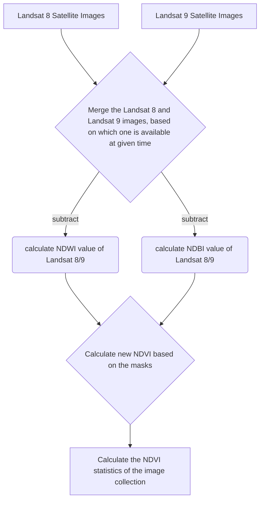

# Postfire biomass and wildlife recovery based on Earth observation data

 

> ## Introduction
> 
> Bushfires represent a persistent threat to Mediterranean ecosystems, with Greecebeing one of the most affected regions in Europe. The frequency and intensity of wildfires in Greek national reserves have prompted urgent research into their long-term effects on forest recovery and the broader ecological impacts. Rapid loss of biomass and habitat fragmentation not only delay forest regrowth but also disrupt animal territories, sometimes resulting in significant population declines and altered migration patterns. Despite growing interest, quantitative models capturing the interplay between fire-induced biomass loss, regeneration processes, and consequences for wildlife remain underdeveloped.
>
> This case study addresses the critical question: How do Greek national reserves recover after bushfires, and what is the relationship between post-fire forest recovery and changes in animal territories and populations? Leveraging multiple Earth observation platforms—including satellite-derived vegetation indices, biomass assessments, and high-resolution optical imagery—we evaluate the accuracy of different data types in monitoring post-fire biomass recovery. Shapefiles of protected area boundaries and known animal habitats are integrated to precisely assess the spatial extent and ecological ramifications of recent fires. Drawing on the Greek context as a detailed case study, we develop a framework designed to evaluate general forest recovery within a time frame and analyse the correlation between fire events and animal territory loss. The model, rooted in Geospatial analytics is then adapted to explore its broader applicability in diverse biomes worldwide, offering a scalable approach for post-fire ecological assessment and conservation planning.

## Methodology for the fire in 2011
The methodology for analyzing the 2011 fire event involves processing satellite imagery to assess changes in vegetation and biomass before and after the fire. By applying spectral indices such as NDVI, NDWI, and NDBI, we filter and mask the satellite data to isolate fire-affected areas and quantify vegetation loss and recovery. The workflow integrates data from multiple Landsat missions, enabling a time series analysis of ecological changes resulting from the fire.

As a result we get the images right before and after the fire event.

.png)

.png)

After this point we can merge the two different plot.

.png)

Where the interesting part is the mean values, as we can consider the maximum and minium values as a noisy range.

.png )

## Methodology for the fire in 2023 